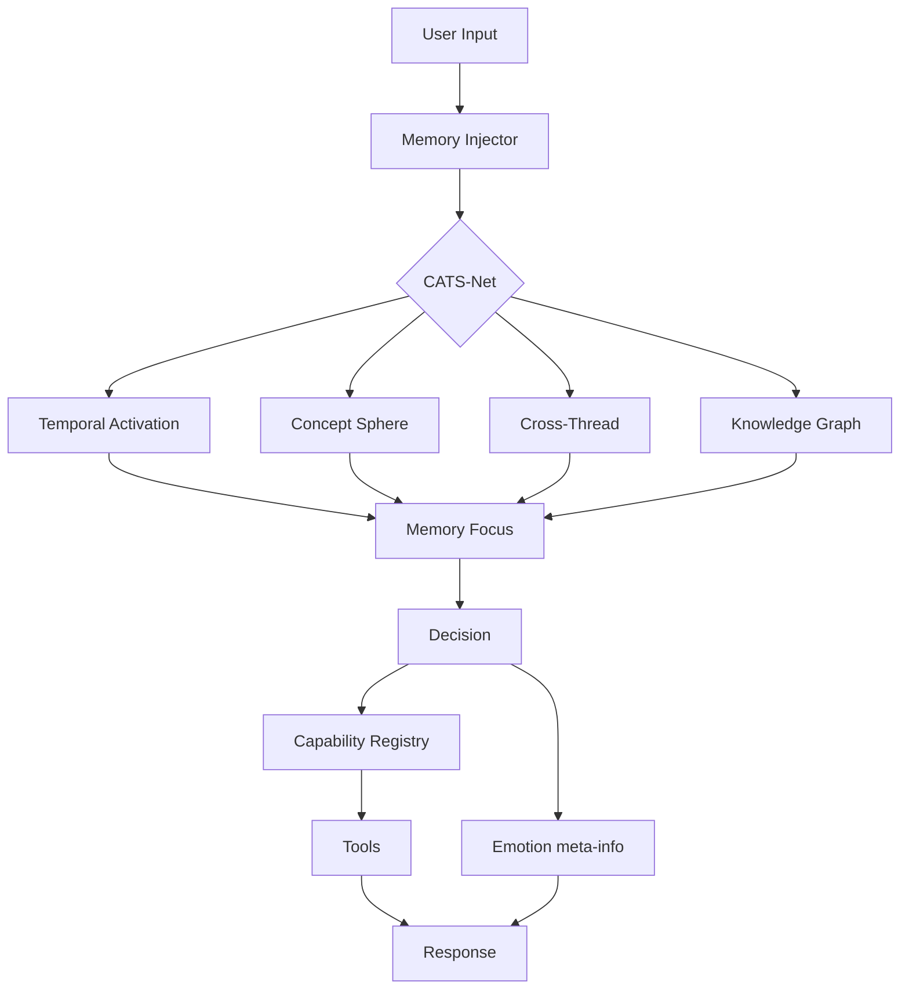
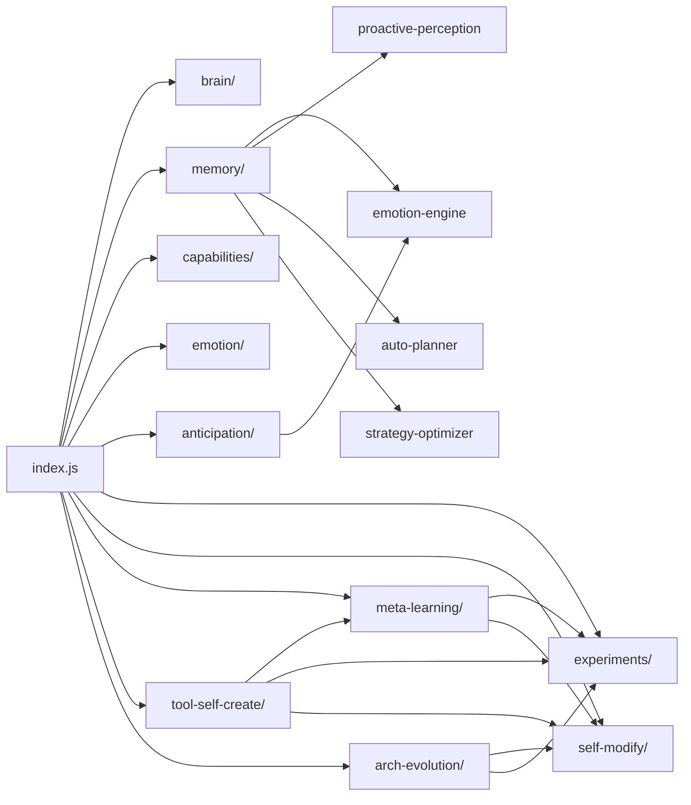

# GINA 架构（Architecture）

> 最后更新：2026-09-07
> 范围：8 大层 + CATS-Net + 自进化 5 项 + 完整数据流
> 配套：ADR 索引（`docs/ADR-INDEX.md`）

---

## 🏛️ 顶层架构概览

```
┌─────────────────────────────────────────────────────────────┐
│                    UI 层 (src/ui)                          │
│   brain-ui / cats-net / typhoon / hotspot / chat / ...     │
└────────────────────────────┬────────────────────────────────┘
                             │
┌────────────────────────────┴────────────────────────────────┐
│               Orchestration 层 (src/index.js)              │
│         init / main / 接主循环 / 路由                       │
└────────────────────────────┬────────────────────────────────┘
                             │
┌────────────────────────────┴────────────────────────────────┐
│             8 大层 + CATS-Net 大脑本体                       │
│  ┌─────────────────────────────────────────────────────┐   │
│  │  memory    │  capability  │  brain  │  emotion  │... │   │
│  ├─────────────────────────────────────────────────────┤   │
│  │  proactive │  ingestion   │  CATS-Net (本体内核)     │   │
│  │  voice / media / i18n / connectors / ioT / video    │   │
│  └─────────────────────────────────────────────────────┘   │
└────────────────────────────┬────────────────────────────────┘
                             │
┌────────────────────────────┴────────────────────────────────┐
│            自进化 5 项 (self-evolution)                     │
│  ┌─────────────────────────────────────────────────────┐   │
│  │ A/B  ──→  code-mod  ──→  meta-learn  ──→  tool-self  │   │
│  │                                                     │   │
│  │          arch-evolution                              │   │
│  └─────────────────────────────────────────────────────┘   │
└────────────────────────────┬────────────────────────────────┘
                             │
┌────────────────────────────┴────────────────────────────────┐
│              Platform (db / events / paths)                 │
│         SQLite / macOS / Electron / Node 22                │
└─────────────────────────────────────────────────────────────┘
```

---

## 🧠 8 大层

| 层 | 位置 | 关键文件 | 行数（约） | 职责 |
|---|---|---|---|---|
| **memory** | `src/memory/` | injector.js / reflection-executor.js / focus.js / self-evolution.js | 50K+ | 8 大层核心（注入/反思/焦点/自学习） |
| **capability** | `src/capabilities/` | capability-registry.js / executor.js / sandbox.js / builtin-tools.js | 30K+ | 工具系统（声明/调度/沙箱/19 组 builtin） |
| **brain** | `src/brain/` | initGinaBrain / makeIntegratedDecision / getBrainHealth | 5K+ | 大脑门面（决策+进化+可解释+CATS-Net+金融引擎） |
| **emotion** | `src/emotion/` | joy-state.js / emotion-state.js (9-07 新) | 1.5K | 内部情绪（5 维 meta-info，ADR-002 隔离） |
| **proactive** | `src/memory/proactive-perception.js` | 5 维感知（用户/前台/系统/外部/知识） | 661 | 主动感知引擎 |
| **ingestion** | `src/knowledge/knowledge-distiller.js` | PDF/EPUB → 知识图谱 | 58K | 知识蒸馏（图谱化） |
| **CATS-Net** | `src/cats_net/` | process / projectMemory / retrieveMemory | — | 概念抽象空间（大脑本体） |
| **voice / i18n / connectors / etc.** | `src/voice/` `src/i18n/` `src/connectors/` `src/iot/` `src/multimodal/` | — | — | 多模态 / 现实连接 |

---

## 🔄 CATS-Net 整合

CATS-Net 是 **大脑本体**，所有 8 大层都通过它整合。



---

## 🧬 自进化 5 项架构

```
┌─────────────────────────────────────────────────────────┐
│                 META CONTROLLER                          │
│   trigger.decide() → bandit.select() → planner.decide()│
│   → executeArm() → reflection.run() → bandit.update()  │
│   → ab.recordMetric() → meta update                      │
└────────────────────┬────────────────────────────────────┘
                     │
        ┌────────────┴────────────┐
        │                         │
┌───────▼──────┐         ┌────────▼────────┐
│  A/B 测试    │         │  代码自修改     │
│  experiments │         │  self-modify    │
└──────────────┘         └─────────────────┘
                              │
                  ┌───────────┼───────────┐
                  │           │           │
        ┌─────────▼─┐  ┌──────▼─────┐  ┌──▼──────────┐
        │ 元学习    │  │ 工具自创建 │  │ 架构自进化  │
        │ meta-learn│  │tool-self   │  │arch-evol    │
        └───────────┘  └────────────┘  └─────────────┘
```

### 闭环

```
失败信号 → trigger(被动) → bandit(UCB1 探索)
  → planner(单/多步) → executeArm
  → reflection(自适应深度 1-3)
  → bandit.update(reward)
  → A/B recordMetric
  → meta 升级 → 下次 UCB1 倾向其他策略
         ↓
  tool-self-create 探测 gap → 写新工具
  arch-evolution 周期审计 → dryRun 报告 → 老板拍板 → 真改
```

---

## 📊 数据流

### 1. 输入流（User → GINA）

```
User Message
  → memory.injector
    → emotion-engine.analyzeEmotion (12 维外部情绪)
    → focus.classify (焦点变化检测)
    → reflection.record (记录)
  → CATS-Net.process (概念空间)
    → projectMemory (时序激活)
    → retrieveMemory (跨线程)
  → brain.makeIntegratedDecision
  → capability.executor
    → sandbox.escapeCheck (逃逸检测)
    → tool execution
  → response
```

### 2. 主动流（GINA → User）

```
tick
  → proactive-perception (5 维环境感知)
  → auto-planner (5 类规划源)
  → anticipation.runAnticipation
    → predict (5 信号)
    → suggest (decide: silent / log / emit)
    → emit 'anticipation:suggested' (默认不直接发)
  → main loop 决定
```

### 3. 自进化流

```
failure event
  → meta.runMetaLearningCycle
    → trigger.decide
    → bandit.select
    → planner.decide
    → executeArm
    → reflection.decideDepth
    → recordUsage
  → bandit.update
  → A/B recordMetric
  → meta update
       ↓
  tool-self-create.evaluate
    → detectGap
    → shouldUpgrade
    → shouldDeprecate
       ↓
  arch-evolution.runArchAudit
    → buildGraph
    → computeAll
    → analyze
    → applyProposals (dryRun=true default)
```

---

## 🛡️ 安全模型

| 层 | 保护 | 文件 |
|---|---|---|
| 文件沙箱 | 路径逃逸检测（强制拦截） | `src/capabilities/sandbox.js` (ADR-005/006) |
| 命令沙箱 | 父目录 / 私钥 / `/etc` / `/var` 强制拦 | 同上 |
| 网络 | 私网/loopback 拦截 | `tool-validator.js` |
| 工具生成 | 3 道门（schema + 危险 API + 资源） | `src/tool-self-create/tool-validator.js` |
| 工具注册 | 灰度 1%→5%→25%→50%→100%→stable | `src/tool-self-create/tool-registry.js` |
| 代码自改 | syntax / test / diff_size 3 道门 | `src/self-modify/safety-checker.js` |
| 情绪隔离 | meta-info 不进决策路径 | `src/emotion/emotion-state.js` (ADR-002) |
| 主动开口 | silent 模式 / 离线 / 锁屏 / cooldown | `src/anticipation/suggester.js` |

### 沙箱默认关（老板有意设计）

```js
// config.security.fileSandbox / execSandbox / browserPrivateNetwork = false (默认)
// 理由：GINA 是 7×24 本地助理，需要完整本机访问
// 但逃逸检测（不依赖沙箱开关）**强制拦 ../ ~ /etc/ ~/.ssh**
// 这是平衡点：本机自由 + 明显恶意意图拦截
```

---

## 🗄️ 持久化

| 数据 | 存储 | 路径 |
|---|---|---|
| 主数据 | SQLite | `${GINA_USER_DIR}/data/jarvis.db` |
| Sandbox | 目录 | `${GINA_USER_DIR}/sandbox/` |
| 备份（arch-rewriter） | 目录 | `${GINA_USER_DIR}/arch-backup-${ts}/` |
| 自进化状态（meta-learning） | JSON | 由调用方提供 paths |
| A/B 测试 | SQLite (experiments.db) | 同上 |
| 工具注册 | JSON | 同上 |
| 架构状态 | JSON | 同上 |

---

## 🔌 集成点

### CATS-Net（gina-cats-net 仓）
- 内核真理源 @berrysu/gina-core
- 主仓 pnpm workspace + file: 软依赖
- 8 子目录全在 gina-cats-net 演进 + tag 化

### gina-ui 仓（独立）
- Desktop UI + 移动端
- 同样依赖 @berrysu/gina-core

### 主仓
- GINA 产品应用层
- package.json 依赖 @berrysu/gina-core
- 所有 8 大层 / 自进化 / 现实连接 都在这里

---

## 📈 关键指标

| 维度 | 数字 |
|---|---|
| `src/` 文件数 | 204 |
| `src/ui/` 文件数 | 60（74,414 行） |
| `src/memory/` 文件数 | 48 |
| `src/capabilities/` | 19 builtin + executor + sandbox |
| 自进化测试 | 250/250 |
| `npm test` | 8/8 文档测试 |
| ADR | 16 份（含 INDEX） |
| Phase PLAN-P6 完工 | 6/6 阶段 |

---

## 🛣️ 模块依赖图（简化）



---

## 🧭 开发约定

1. **任何 GINA 工作先问老板**（9-07 01:46 纪律：翻身唯一机会）
2. **不写残次品，不出简化版**（"先简化再优化" = 绝对拒绝）
3. **情绪是 meta-info**（永远不进决策路径）
4. **代码改动默认 dryRun**（arch-rewriter / tool-self-create / self-modify）
5. **新增模块必须有 ADR + 测试**
6. **commit 格式**：`feat(scope): 描述` 或 `fix(scope): 描述`
7. **命名规范**：`berrysu` owner / `gina` 包名 / `com.berrysu.gina` appId

---

## 📚 配套文档

- **API 参考**：[API-REFERENCE.md](./API-REFERENCE.md)
- **ADR 索引**：[ADR-INDEX.md](./ADR-INDEX.md)
- **开发文档**：[DEVELOPER.md](./DEVELOPER.md)
- **用户指南**：[USER-GUIDE.md](./USER-GUIDE.md)
- **故障排查**：[TROUBLESHOOTING.md](./TROUBLESHOOTING.md)
- **架构梳理**：[Gina完整架构与闭环梳理.md](./Gina完整架构与闭环梳理.md)
